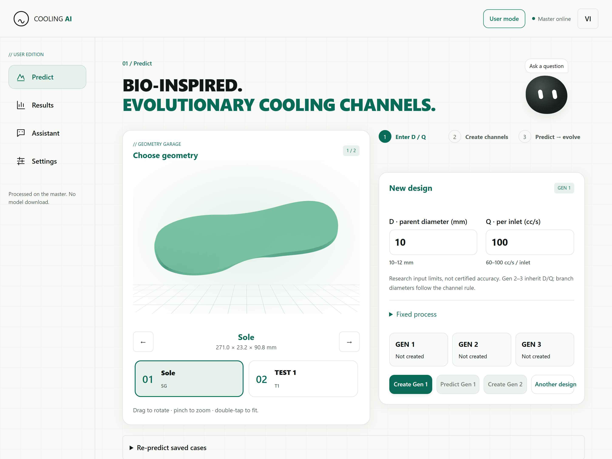

<picture>
  <source media="(prefers-color-scheme: dark) and (max-width: 600px)" srcset="https://raw.githubusercontent.com/soun26/soun26/main/assets/hero-dark-mobile-motion.svg?v=vector-v2">
  <source media="(max-width: 600px)" srcset="https://raw.githubusercontent.com/soun26/soun26/main/assets/hero-light-mobile-motion.svg?v=vector-v2">
  <source media="(prefers-color-scheme: dark)" srcset="https://raw.githubusercontent.com/soun26/soun26/main/assets/hero-dark-motion.svg?v=vector-v2">
  
</picture>

[Projects](#selected-work) &nbsp; · &nbsp; [Experience](#experience) &nbsp; · &nbsp; [Skills](#skills)

I'm **Lê Nguyễn Trần Tiến**, also known as **Soun**. My main focus is **Mechanical Engineering**.

I work on mechanical design, simulation, programming and manufacturing. With each project, I learn more about the related fields. My research interests include structural strength in aerospace applications, bio-inspired evolutionary cooling channels and 5-axis 3D printing.

## Selected work

<a href="https://cooling-ai-user.lengtrtien2610.workers.dev/">
  <picture>
    <source media="(prefers-color-scheme: dark) and (max-width: 600px)" srcset="https://raw.githubusercontent.com/soun26/soun26/main/assets/cooling-dark-mobile-motion.svg?v=vector-v1">
    <source media="(max-width: 600px)" srcset="https://raw.githubusercontent.com/soun26/soun26/main/assets/cooling-light-mobile-motion.svg?v=vector-v1">
    <source media="(prefers-color-scheme: dark)" srcset="https://raw.githubusercontent.com/soun26/soun26/main/assets/cooling-dark-motion.svg?v=vector-v1">
    
  </picture>
</a>

**Bio-inspired evolutionary cooling channels** — cooling networks that follow complex part geometry and evolve to improve thermal uniformity in plastic injection molding.

[Open web app →](https://cooling-ai-user.lengtrtien2610.workers.dev/) &nbsp; · &nbsp; [Web source](https://github.com/soun26/cooling-ai-web) &nbsp; · &nbsp; [Research overview](https://github.com/soun26/soun26/blob/main/projects/bio-inspired-cooling.md)

<a href="https://github.com/soun26/fdut-5axis-printing">
  <picture>
    <source media="(prefers-color-scheme: dark) and (max-width: 600px)" srcset="https://raw.githubusercontent.com/soun26/soun26/main/assets/fractal-dark-mobile-motion.svg?v=vector-v1">
    <source media="(max-width: 600px)" srcset="https://raw.githubusercontent.com/soun26/soun26/main/assets/fractal-light-mobile-motion.svg?v=vector-v1">
    <source media="(prefers-color-scheme: dark)" srcset="https://raw.githubusercontent.com/soun26/soun26/main/assets/fractal-dark-motion.svg?v=vector-v1">
    
  </picture>
</a>

**5-axis 3D printing research** — simulation and visualization of multi-axis printing motion and toolpaths.

[View project →](https://github.com/soun26/fdut-5axis-printing) &nbsp; · &nbsp; [Read the overview](https://github.com/soun26/soun26/blob/main/projects/five-axis-3d-printing.md)

[Watch the demo video →](https://github.com/soun26/fdut-5axis-printing/blob/main/docs/media/printing-demo.mp4)

Source code is private. [Contact me for source access →](https://github.com/soun26/fdut-5axis-printing/issues/new?title=Source%20access%20request)

## Experience

- **Vietnam Mold Grand Prix 2026:** experience in plastic injection mold design and fabrication through the competition.
- **Injection-mold research:** participated in mathematical modelling and cooling-channel prediction.
- **CNC machining:** hands-on experience working with CNC machines.
- **Aircraft components:** experience designing machining processes for aircraft parts.

## Skills

- **Mechanical design:** AutoCAD, SolidWorks, NX and Creo Parametric.
- **Engineering simulation:** Abaqus, ANSYS and Moldex3D.
- **Programming:** Python and MATLAB.

---

Soun · Mechanical Engineering
